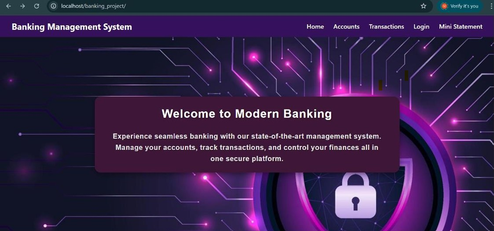
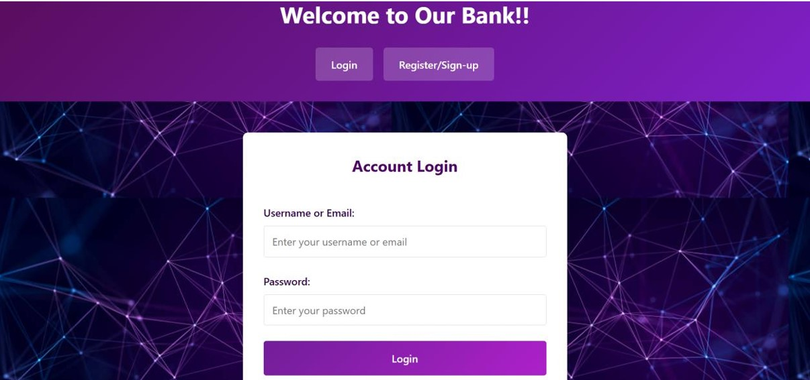
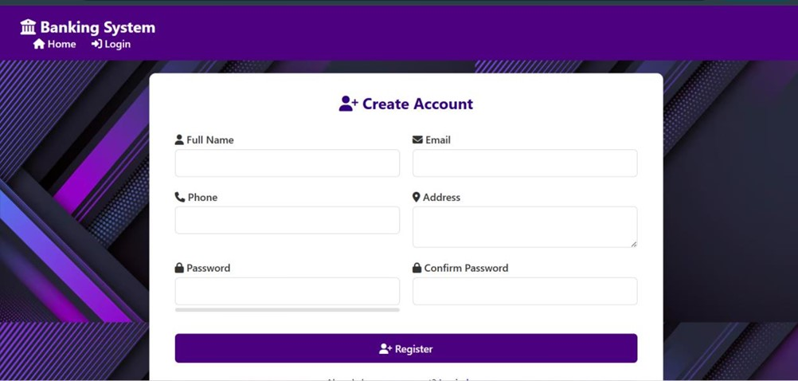
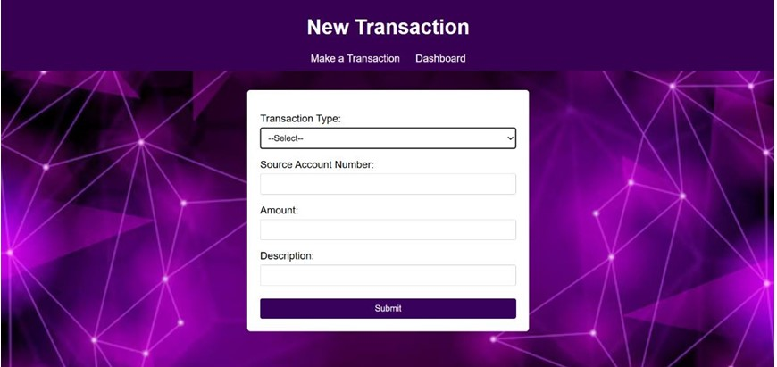
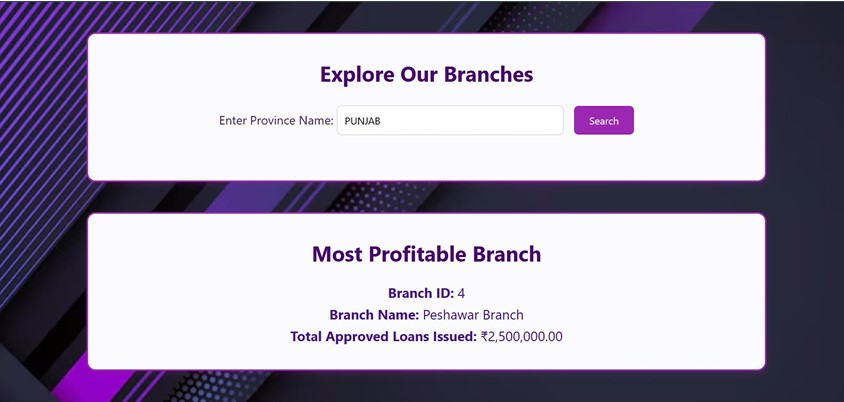

# 🏦 Banking Management System — Web Application

### Course: **Advanced Database Management Systems**

---

##  Overview

The **Banking Management System (BMS)** is a **web-based application** developed to simulate real-world banking operations in a digital environment.

The system allows users to **register accounts, perform financial transactions, check balances, manage loans, and explore bank branches** through a secure and user-friendly interface.

This project demonstrates the **integration of frontend web technologies with backend database management** using **PHP and MySQL**, while implementing essential database concepts such as **relational schemas, queries, joins, and secure authentication**.

The application is designed as a **single-page banking system** where users and administrators can manage banking data efficiently.

---

#  Project Objectives

* Develop a **web-based banking management system**
* Implement **database connectivity using PHP and MySQL**
* Demonstrate **real-time transaction management**
* Apply **secure authentication and validation techniques**
* Integrate **frontend and backend technologies**

---

#  Key Features

### 👤 User Management

* Customer **registration and login system**
* Secure **authentication and session handling**
* Account creation with automatic account number generation

###  Banking Operations

* Deposit, withdraw, and transfer funds
* Real-time balance updates
* Transaction history and mini statements

###  Dashboard & Account Overview

* View **account summary**
* Display **recent transactions**
* Admin overview of accounts and balances

###  Branch Management

* Search for branches based on province
* Display branch statistics and availability

###  Loan Management

* Loan eligibility checking
* Loan request submission
* Track loan status by branch

### 👥 Team Information

* Dedicated **Meet Our Team** section

---

# 🛠️ Technologies Used

### Frontend

* **HTML**
* **CSS**

### Backend

* **PHP**

### Database

* **MySQL**
* **phpMyAdmin**

### Development Environment

* **XAMPP (Apache + MySQL)**

---

#  System Architecture

The application follows a **three-layer architecture**:

### 1️⃣ Frontend Layer

Provides the **user interface** using HTML and CSS.

### 2️⃣ Backend Layer

Handles:

* Business logic
* Form processing
* Authentication
* Database interaction

### 3️⃣ Database Layer

MySQL database stores:

* Customer data
* Account records
* Transactions
* Loans
* Branch details
* Employee information

---

# 🗄️ Database Design

The system uses a **relational database schema** with the following tables:

| Table        | Description                                |
| ------------ | ------------------------------------------ |
| Customers    | Stores customer personal information       |
| Accounts     | Stores bank account details                |
| Transactions | Records deposit, withdrawal, and transfers |
| Employees    | Bank employee records                      |
| Loans        | Loan requests and status                   |
| Branches     | Branch information                         |

---

# 🚀 How to Run the Project

### Step 1 — Clone the Repository

```bash
git clone https://github.com/Mishal-Raziq/BMS-WEBSITE-ADV-DBMS-.git
cd BMS-WEBSITE-ADV-DBMS-
```

### Step 2 — Setup XAMPP

1. Install **XAMPP**
2. Start **Apache** and **MySQL**

### Step 3 — Setup Database

1. Open **phpMyAdmin**
2. Create a database named:

```
MISHAL
```

3. Import the SQL tables if available or create tables manually.

### Step 4 — Run the Application

Move the project folder into:

```
xampp/htdocs/
```

Then open in browser:

```
http://localhost/BMS-WEBSITE-ADV-DBMS-/
```

---

# 📸 Project Screenshots

## 🏠 Home Page



---

## 🔐 Login Page



---

## 📝 Registration Page



---

## 💳 Transactions Page



---


## 🏦 Branch Management



---*Note: Only selected screenshots are included here. The project contains additional features and pages not shown above.*

---

# 🔐 Security Measures

The system includes multiple security mechanisms to protect user data:

### SQL Injection Prevention

Prepared statements using:

```
prepare()
bind_param()
```

### Password Security

Passwords are securely stored using:

```
password_hash()
password_verify()
```

### Session Management

PHP sessions are used to ensure only authenticated users can access protected pages.

### Input Validation

Both frontend and backend validations are applied:

* Email validation using `filter_var()`
* Numeric validation for amounts and IDs
* Password length requirements
* Required field verification

---

#  Validation & Error Handling

To ensure system reliability:

* Forms validate **empty fields**
* Invalid email formats are rejected
* SQL query execution is verified
* Friendly error messages are displayed
* Empty results are handled gracefully

---

# 🎓 Learning Outcomes

Through this project, the following skills were developed:

* Full-stack **web development using PHP and MySQL**
* Database design and **ER modeling**
* Implementation of **secure authentication**
* Integration of **frontend and backend systems**
* Writing and optimizing **SQL queries**
* Implementing **session-based security**

---

# ⚠️ Challenges Faced

Some major challenges during development included:

* Configuring **database connectivity** with PHP
* Managing **secure session authentication**
* Designing efficient **SQL queries across multiple tables**
* Implementing **input validation and security practices**
* Integrating dynamic backend logic with the frontend interface

These challenges improved problem-solving skills and provided valuable experience in **secure web application development**.

---

#  Future Improvements

Possible enhancements include:

* GUI improvements with **JavaScript frameworks**
* Advanced **search and filtering features**
* Export reports in **PDF or CSV**
* Role-based **admin dashboard**
* Stronger security using **JWT authentication**

---

# 👨‍💻 Author

**Mishal Raziq**

BS Computer Science Student
Course: **Advanced Database Management Systems**

---

⭐ If you found this project useful, consider **starring the repository**.
